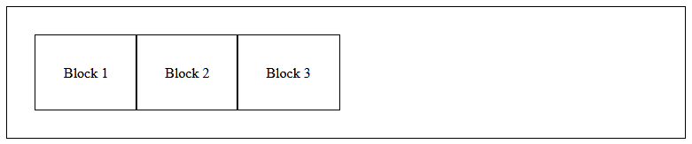

# CFT2111 Page Layout with CSS
1. Download the file [list-based-navigation.html](list-based-navigation.html).
    * Add some CSS to this page. Check it works.
    * Try and make the list into a horizontal navigation bar.
    * Have a look on the lecture slides to help you. Here are some CSS properties that will help:
        * display
        * text-decoration
        * padding / or width
     * Add a 'hover' effect to the buttons. If you look back at Week 3 and using psuedo classes with hyperlinks.
     * If you can get this to work. Can you create an animated hover using a CSS transition see https://developer.mozilla.org/en-US/docs/Web/CSS/CSS_transitions/Using_CSS_transitions for some advice. 

2. Download the file [flexbox.html](flexbox.html).
    * Add some CSS to this page. Check it works.
    * Put an outline and some padding around each of the *div* elements e.g.
    ```css
    div{
        outline:1px solid red;
        padding:2.0em;
    }
    ```
    * Using the flex properties create the following arrangements




3. Download the file [grids.html](grids.html).
    * Add some CSS to this page. Check it works.
    * Put an outline around each of the <div> elements.
    * Using the grid properties create the following arrangements. For the second, third and fourth examples the grid should resize to the browser width.

     

    

    

    

   * Can you create a layout like the third of these images by using the flexbox instead of CSS grids. One way of doing this is to use flex-wrap - https://developer.mozilla.org/en-US/docs/Web/CSS/flex-wrap.

4. Change the *div* tags in the CSS Grid example to use suitable semantic elements e.g. *header*, *footer* etc. Add CSS to create the 'holy grail' of web design i.e. a full width header and footer, and three columns.


5. Combine some of the above:
    * Use a flexbox to arrange the navigation options in exercise 1
    * Place this navigation bar in the header of exercise 4.
